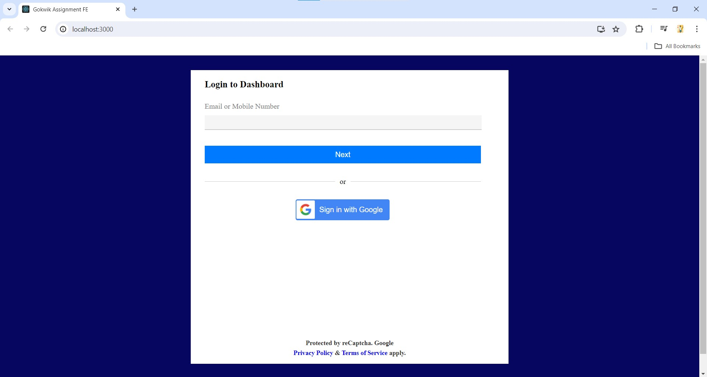

# GoKwik-Assignment-FE
Simple React Login form With Validation




## Usage

This project uses validates the given input Mobile/Email and displays an alert when the input is valid

### Install Dependencies

```bash
npm install
```

### Run Frontend
```bash
npm start
```
The local development server will run on http://localhost:3000

### Netlify Deployed Link

https://gokwik-assignment-fe.netlify.app/
